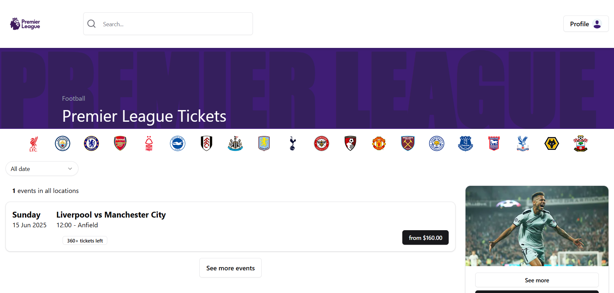

# go-premierleaguebooking

## Technical stack

- Backend building blocks
  - [grpc-ecosystem/grpc-gateway/v2](https://github.com/grpc-ecosystem/grpc-gateway)
  - [kyleconroy/sqlc](https://github.com/kyleconroy/sqlc)
    - [pq](github.com/lib/pq)
  - [golang-jwt/jwt/v4](https://github.com/golang-jwt/jwt)
  - [hibiken/asynq](https://github.com/hibiken/asynq)
  - Utils
    - google/uuid
    - google.golang.org/genproto
    - google.golang.org/grpc
    - google.golang.org/protobuf
- Infrastructure
  - Postgres, Redis
  - Google Cloud Platform(GCP), Google Kubernetes Engine (GKE)
  - docker and docker-compose
  - devcontainer for reproducible development environment

## Premier League Booking

## Screenshots

### Home screen

### View Tickets screen

### Proceed Payment screen

### Review Checkout screen

### Payment screen

### Review Checkout

### Payment screen
[Stripe Test Card Numbers](https://docs.stripe.com/testing)

## Cache Strategies Performance Comparison

